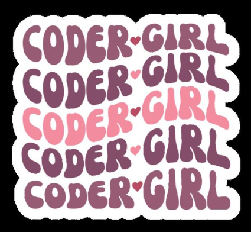

# Bem Vindo(a) ao meu GitHub! 👋

 
   

 

🌱 Estudante de Sistemas de Informação na UFU 

👾 Ensinando Programação para Meninas do EM 

🧠 Técnica de Informática pelo SENAI

💻 Maratonas de Programação

💁🏾‍♀[Include Girls](https://includegirls.facom.ufu.br/)

  
  &nbsp;  
  &nbsp;  
  &nbsp;   
  &nbsp;  

  
